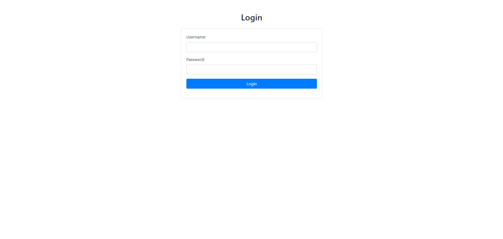
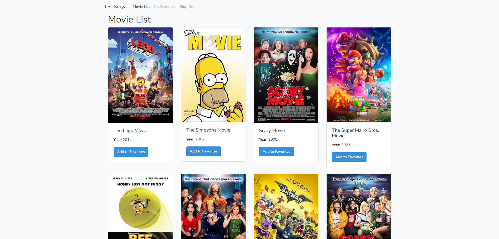
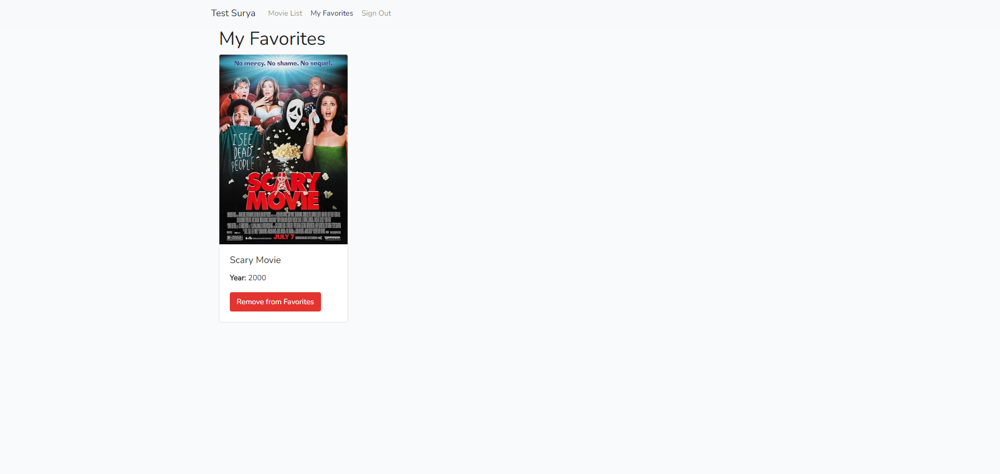
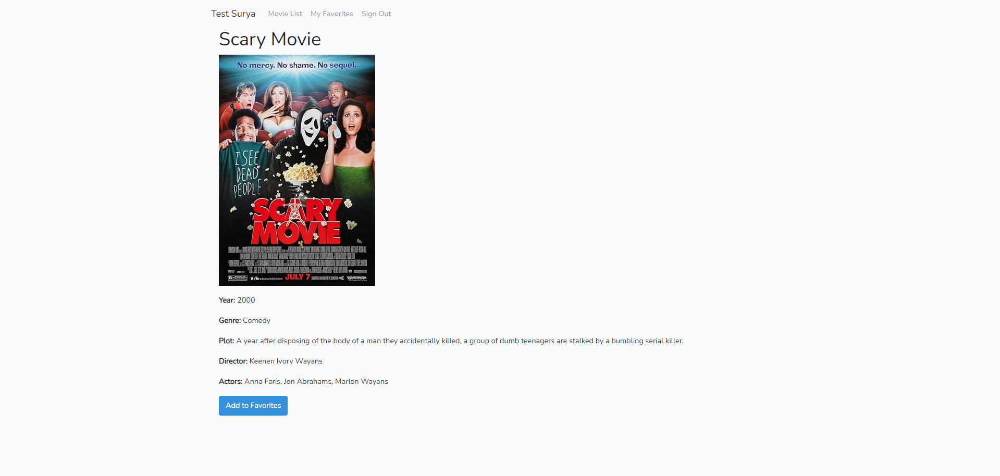

# Laravel 5 Project

## Description

This is a Laravel 5 project that utilizes the OMDb API to retrieve movie data. The project is built with PHP 7 and uses MySQL 8 as the database management system.

## Features

- Fetch movie information from the OMDb API using GuzzleHttp.
- Easy to extend and customize for additional features.

## Requirements

- PHP 7.x
- MySQL 8.x
- Laravel 5.x
- Composer
- GuzzleHttp library

## Installation

1. Clone the repository:
   ```bash
   git clone https://github.com/yhaae01/test-advisor-surya
   cd test-advisor-surya

## Screenshot 
1. Login page

2. Movie List

3. My Favorites

4. Detail Page
